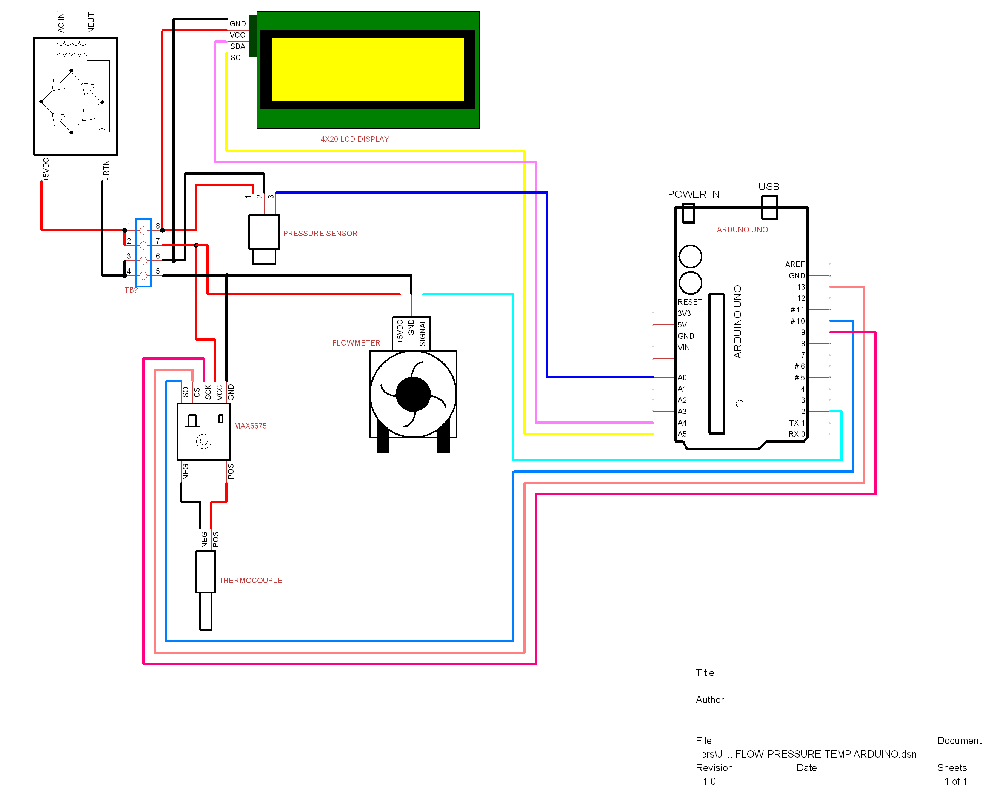

Arduino project reading from three sensors and outputing to an lcd.

## Components
* Arduino UNO
  * SainSmart
* LCD 4 X 20 
  * LCD Module 2004A
  * With i2c and SPI input/output expander
  * [I2C search](http://www.google.com/search?q=I2C)
  * [New LiquidCrystal](https://bitbucket.org/fmalpartida/new-liquidcrystal/wiki/Home) with I2C support by 
Francisco Malpartida
  * Others
    * Sunfounder Wiki with LiquidCrystal_I2C library [I2C LCD2004](http://wiki.sunfounder.cc/index.php?title=I2C_LCD2004) 
    * [Adafruit_LiquidCrystal library](https://github.com/adafruit/Adafruit_LiquidCrystal)
* Pressure Sensor
  * 300 PSI
  * Kavlico P4000
  * [Product page](http://www.kavlico.com/kavlico-pressure/pressure-products/piezo-resistive-pressure-sensors/p4000) with link to datasheet
* Flow Sensor
  * AICHI
  * Model OF05ZAT
  * Label on bag: STK0151012824
  * [Product page and Data Sheet](https://www.aichitokei.net/products/microflow-sensor-of-z/)
* Thermocouple, 
  * MAX 6675 (V1.2) 
    * GND, VCC, SCK, CS, SO
  * Datasheets
    * https://datasheets.maximintegrated.com/en/ds/MAX6675.pdf
    * https://www.sparkfun.com/datasheets/IC/MAX6675.pdf
  * [MAX6675-library](https://github.com/adafruit/MAX6675-library)
  * Note: MAX 6675 has been discontinued/retired. Adafruit has the [MAX31855](https://www.adafruit.com/product/269) as the upgrade.

## Arduino Schematic
Wiring diagram showing LCD output with Flow, Pressure, and Temperature sensors

